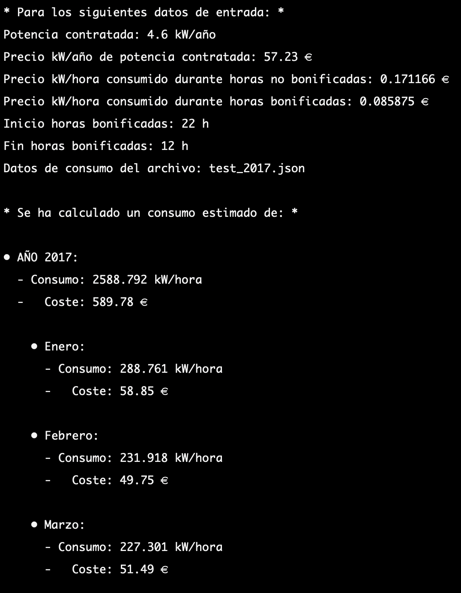
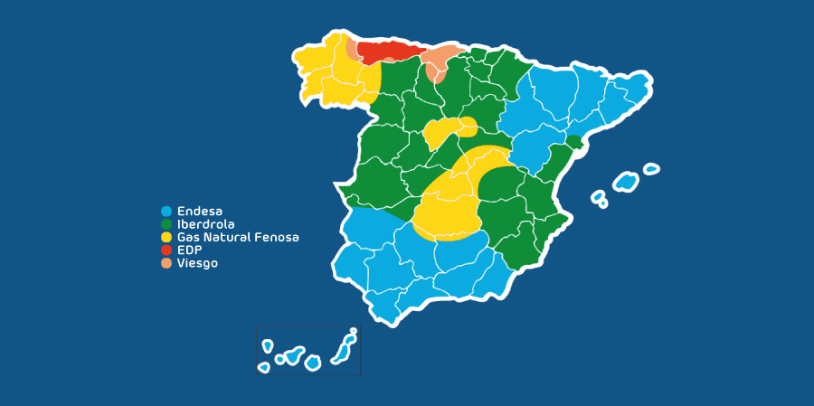

# Iberdrolux
Calculador de precios para tarifas eléctricas usando datos de consumos horarios anteriores obtenidos de Iberdrola Distribución Eléctrica (i-de.es)

# Propósito:
Programa que muestra el consumo en Kilowatios y calcula el precio que se habría obtenido con la tarifa introducida por el usuario, para el periodo determinado en base a los datos de consumos anteriores extraídos del Área Clientes para Particulares de Iberdrola Distribución Eléctrica.
El programa aplica la tarifa deseada a los datos de consumo horario proporcionados por Iberdrola Distribución Eléctrica. Más abajo se detalla cómo obtener estos datos.

Tras ejecutarlo, se obtendrá algo como lo siguiente:

Independientemente de la empresa que te comercialice la electricidad, este programa sólo funciona con datos de consumo procedentes de Iberdrola Distribución Eléctrica. En España, las distribudoras eléctricas se distribuyen por zonas geográficas, atendiendo aproximadamente al siguiente reparto:

(Fuente: https://alcanzia.es/blog/distribuidoras-electricas-en-espana-por-zonas/)

 
Puedes consultar cuál es tu distribuidora a través del CUPS o contactando con tu comercializadora.

# Instrucciones:
### 1. Registro en Iberdrola Distribuidora
En primer lugar, es necesario estar **registrado en el área clientes** de **I-DE** (https://www.i-de.es). La cuenta **no es la misma que la de la comercializadora Iberdrola** (https://www.iberdrola.es). Si no estás registrado, puedes hacerlo desde https://www.i-de.es/consumidores/web/guest/register?start=false. Para completar el registro necesitarás:
    - Una factura de luz (donde figura el CUPS)
    - Tu móvil
    - Tu correo electónico
    - Número de documento de identidad

### 2. Accede a tu cuenta
Una vez completado el registro y la verificación del email, **accede a tu cuenta** con el usuario y contraseña que hayas elegido. Deberías poder ver tu consumo y potencia recientes, entre otroas muchas opciones.

### 3. Consigue tu consumo en archivo .json
Con la sesión iniciada en <a href='https://www.i-de.es'>i-de.es</a>, **accede a la siguiente dirección** desde tu navegador:
https://www.i-de.es/consumidores/rest/consumoNew/obtenerDatosConsumoPeriodo/fechaInicio/01-01-201900:00:00/fechaFinal/31-12-201900:00:00/

Modificando los valores *01-01-201900:00:00* y *31-12-201900:00:00* en función del intervalo de días para los que quieras obtener el consumo horario. En este ejemplo, el navegador mostrará los consumos energéticos para cada hora de 2019, mostrando por tanto un total de 8760 consumos horarios (24 horas * 365 días).

### 4. Guardar el archivo
**Guarda el archivo *.json*** en tu ordenador. Según tu navegador, podrás hacer esto pulsando en *Archivo > Guardar como*, o desde *Ctrl + S* en Windows o *Cmd + S* en macOS. Si el navegador te preguntara, asegúrate de guardar el archivo *como archivo de texto*, y de que el nombre del archivo termine en *.json*. Es posible que el navegador no te permita hacer esto, y lo tengas que descargar como *.txt*. En este caso tendrás que cambiar el nombre del archivo posteriormente para que termine en *.json.*

### 5. Descargar el repositorio
**Clona el repositorio** desde la consola de tu ordenador, o descarga el proyecto como un zip desde el botón *Code > Download ZIP*. Descomprime el proyecto y coloca el archivo *.json* que descargaste en el paso anterior en la misma carpeta que *iberdrolux.py*.

### 6. Ejecuta Iberdrolux
Ejecuta **py -3 iberdrolux.py** en Windows, o **python3 iberdrolux.py** en Unix. Es posible que para ello tengas que asignarle permiso de ejecución al archivo o instalar *Python 3*.

Ejecutar un archivo de Python es muy fácil en cualquier sistema operativo, tienes más información de cómo hacerlo aquí: https://robustiana.com/325-ejecutar-scripts-python-windows-y-ubuntu.

Instalar Python 3 es muy fácil en cualquier sistema operativo, tienes más información de cómo hacerlo aquí: https://tecnonucleous.com/2018/01/28/como-instalar-pip-para-python-en-windows-mac-y-linux/

### ¿La URL para obtener el consumo horario ya no funciona?
Abre un issue o escríbeme a <a href='mailto:m.varona@bmsalamanca.com'>m.varona@bmsalamanca.com</a> e intentaré encontrar una solución.

¡Espero que Iberdrolux te sea útil para ahorrar en tu próxima factura de la luz!
